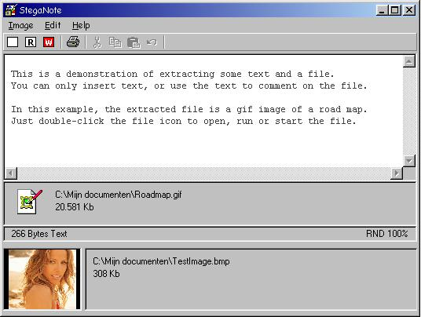



## Steganography with StegaNote 3\.1

### Description

StegaNote is the solution to protect and transmit sensitive information on a secure way. StegaNote uses crypto-secure steganography to merge a compressed file, text (from the included text editor) or both file and text with a carrier image, totally invisible for human eye. The technique of RPP, Random Pixel Positioning, ensures that even when it's known that the image is a data carrier, it is impossible to retrieve and compose the original bit sequence. RPP uses a pseudo random generator (PRNG) in feedback mode, initialised by a secret key or passphrase, producing a serie of coordinates to identify the pixels, used to carry the data. This results in a wide spreading of all data bits all over the carrier image. RPP combines fractionation and transposition to achieve the required diffusion, enhance by insertion into a large amount of irrelevant information. A random header is added to the data, to ensure that each encryption - read bit spreading - is unique, even with identical data, key and image. The data bits are stored in the Least significant bit from the primary colors red, green and blue of the image pixels. Therefore, the largest possible change is 1/255th for each seperate colors value of a pixel, leaving it totally invisible. 32Kb of text will only need a 200 X 200 carrier image. An image is a collection of various colors and shades with many different RGB values. The advantage of RPP is that cryptanalysis is impossible, while it is unknow which part of the image is original image, and which part data. Cryptanalysis requires at least the encrypted data. Even comparing the carrier with an original 'blank' version of the image will only show the non equal bits. Many data bits, equal in value to the original image bits, cannot be located. Since the PRNG is in feedback mode, a one-bit error is fatal to the pixel sequence generation. Therefore, retrieving the pixel coordinate sequence by analysis is impossible due to missing encrypted data. Many steganography programs encrypt the data, and then merge the data on a unsecure manner with the image. In that case, filtering the data from the carrier is possible and cryptanalysis can be applied on the retrieved data. Thanks to the RPP technique, retrieving the data is impossible. StegaNote v3.1 is ready to use and has an easy and clear user interface, making it very easy to work with the program. No fancy stuff or graphics, only solid protection. No more, no less. A very informative helpfile is included. Lots of comments in the sourcecode! *** Try out StegaNote! The zip includes a file called TestImage.bmp: Select this image as carrier, hit the read button and enter the word steganography as key. A text and road map are extracted from the carrier image :-O *** All comments or feedback most welcome. (updated 11/3 - v3.1 enabled cancel saving and bmp size warning)
 
### More Info
 

             |
---                |---
**Submitted On**   |2005-07-07 16:45:08
**By**             |[D\. Rijmenants](https://github.com/Planet-Source-Code/PSCIndex/blob/master/ByAuthor/d-rijmenants.md)
**Level**          |Intermediate
**User Rating**    |5.0 (99 globes from 20 users)
**Compatibility**  |VB 5\.0, VB 6\.0
**Category**       |[Encryption](https://github.com/Planet-Source-Code/PSCIndex/blob/master/ByCategory/encryption__1-48.md)
**World**          |[Visual Basic](https://github.com/Planet-Source-Code/PSCIndex/blob/master/ByWorld/visual-basic.md)
**Archive File**   |[Steganogra1945511132005\.zip](https://github.com/Planet-Source-Code/d-rijmenants-steganography-with-steganote-3-1__1-61511/archive/master.zip)

